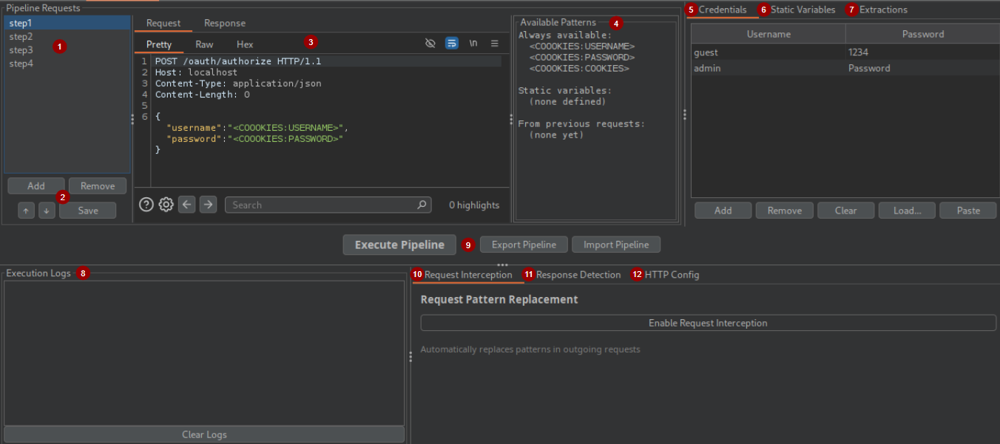

# COOOKIES - Burp Suite Extension


A powerful Burp Suite extension for automating complex authentication flows and managing session tokens across multiple user accounts. Perfect for penetration testers working with OAuth, multi-step logins, or any application requiring sophisticated session management.


## 🔎 Overview

COOOKIES automates the tedious process of maintaining authenticated sessions for multiple users during security testing. It allows you to:

- **Build authentication pipelines** with multiple sequential requests
- **Manage multiple user sessions** simultaneously
- **Auto-inject authentication tokens** into your testing workflow
- **Auto-refresh expired sessions** when detecting logout responses

Macros? Love 'em. But there's currently no way for an extension to kick off a macro flow via API. COOOKIES lets you do exactly that—catch session expirations mid-test and re-auth on the fly without breaking stride.

## 🖥️ GUI Overview



1. List of requests in the pipeline
2. Buttons to add/remove/move a request in the pipeline
3. Editor for selected raw HTTP request
4. List of currently available patterns for the selected request
5. Tab that handles credentials
6. Tab that handles custom static variables
7. Tab that hanldes custom extraction rules, executed on the response associated to the currently selected request
8. Pipeline execution logs
9. Execute pipeline, import and export buttons
10. Request interception menu: allows to toggle on/off request interception feature
11. Response interception menu: allows to toggle on/off response interception feature and to define the custom expiration strings
12. Configuration area for HTTP protocol ( port, https/http )

## ✨ Features

### 🔄 Authentication Pipeline Builder

Create multi-step authentication flows with ease:

- **Sequential Request Execution**: Chain multiple HTTP requests in order
- **Dynamic Value Extraction**: Extract tokens, cookies, or any data from responses using:
  - **Header Extraction**: Extract values from HTTP headers
  - **JSON Extraction**: Parse JSON responses with path notation (e.g., `['data']['token']`)
  - **Regex Extraction**: Use regular expressions with capture groups for complex patterns
- **Variable Substitution**: Inject extracted values into subsequent requests
- **Response Preview**: View responses for each request to verify extraction rules

### 👥 Multi-User Session Management

Handle multiple user accounts efficiently:

- **Bulk Credential Loading**: Import credentials from files or paste directly
- **Parallel Session Maintenance**: Execute the authentication pipeline for all users
- **Per-User Variable Storage**: Each user's extracted values are stored independently

### 🚀 Request Interception

- **Pattern Replacement**: Automatically replace COOOKIES patterns in outgoing requests
- **Tool Integration**: Works with Repeater, Intruder, and other Burp tools

### 🔁 Automatic Session Refresh

- **Custom Expiration Patterns**: Define your own logout/expiration detection strings
- **Session Expiration Detection**: Monitor responses for configured expiration strings
- **Auto-Refresh**: Automatically re-execute the pipeline when sessions expire

## 🛠️ Installation

### Requirements

- Burp Suite Professional v2025.11 or later

### Installation Steps

1. **Download the JAR file**
   - Click Releases
   - Download `COOOKIES.jar`

2. **Load in Burp Suite:**
   - Open Burp Suite Professional
   - Go to `Extensions` → `Installed`
   - Click `Add`
   - Select `COOOKIES.jar`

## 📖 Usage Guide

### 1. Setting Up an Authentication Pipeline

1. **Navigate to the COOOKIES tab**
2. **Add requests to your pipeline:**
   - Click `Add` in the Pipeline Requests section
   - Name your request (e.g., "Get Login OTP", "Submit Credentials", etc.)
   - Edit the raw HTTP request in the Request editor:
   - When a request in the pipeline is selected, inside the `Available Patterns` panel you can find a list of all the injectable values currently available ( `<COOOKIES:USERNAME>`, `<COOOKIES:extractionName>`, etc. )
3. **Configure extractions** for each response in the pipeline:
   - Select the desired response
   - Go to the `Extractions` tab
   - Click `Add Extraction` or `Extract Auth Value`
   - Choose extraction type (Header/JSON/Regex) and provide the extraction rule
   - The dynamically extracted value will be available for every following step in the pipeline, as well as in the other Burp Tools

### 2. Adding Credentials

**Method 1: Manual Entry**
- Go to `Credentials` tab
- Click `Add` and enter username and password

**Method 2: Bulk Import**
- Prepare a file with `username:password` per line
- Click `Load...` and select the file

**Method 3: Paste**
- Copy credentials from anywhere (format: `username:password` per line)
- Click `Paste`

### 3. Variable Patterns

Use these patterns in your requests:

- `<COOOKIES:USERNAME>` - Current username ( PIPELINE ONLY )
- `<COOOKIES:PASSWORD>` - Current password ( PIPELINE ONLY )
- `<COOOKIES:COOKIES>` - Aggregated cookies from Set-Cookie header of previous step in the pipeline ( PIPELINE ONLY )
- `<COOOKIES:API_KEY>` - Custom static variables ( PIPELINE ONLY )
- `<COOOKIES:extractionName>` - Value extracted by a extraction rule in a previous step ( PIPELINE ONLY )
- `<COOOKIES:username:extractionName>` - User-specific extracted value ( other Burp Tools )
- `<__COOOKIES__:username>` - Final auth value for a specific user ( other Burp Tools )

### 4. Executing the Pipeline

1. Click `Execute Pipeline` in the middle panel
2. Monitor progress in the Execution Logs
3. Verify extracted values are correct

### 5. Use Patterns in Burp Tools

**IMPORTANT:** `Request Interception` in the bottom-right panel needs to be enabled for this feature to work

**Automatic Injection:**
1. Use patterns in Repeater, Intruder, etc.
2. Patterns are automatically replaced when detected with the actual values

**Insertion with Montoya API Sub-Menu:**
1. Right-click in a request editor
2. Select the `Extension` submenu and then `COOOKIES`
3. Choose the pattern to insert:
   - If text was selected before right-clicking, the pattern will be injected directly
   - Otherwise copied in clipboard

**Quick Cycling:**
- Press Hotkey in Repeater to quickly cycle between available users
- Default keybinding is `Ctrl+Shift+C`, but can be changed inside Settings > Extensions > COOOKIES , but the extension needs to be reloaded

**Third Party Tools:**
- Since the Proxy itself is a burp component, the extension is also able to edit requests that are simply being proxied via burp
```bash
curl -is "https://auth.example.com/" -H "Authorization: Bearer <__COOOKIES__:username>" -x http://127.0.0.1:8080 -k
```

### 6. Session Auto-Refresh

1. Go to `Response Detection` tab
2. Enable `Response Interception`
3. Add session expiration strings (e.g., "Session expired", "401 Unauthorized", etc.)
4. When detected, the pipeline automatically re-executes
5. The responses which are flagged as "Expired session" will have a custom header injected in them: `### Coookies-Expiration: HIT`

### 7. Debug

If needed, look at the Burp Logger to see if patterns are being replaced correctly both in pipeline execution and for patterns used inside of the Burp Tools

## 🔧 Configuration

### HTTP Service Configuration

Configure default settings for pipeline requests:

- **Default Port**: Set the default port (443 for HTTPS, 80 for HTTP)
- **Force HTTPS**: Force all pipeline requests to use HTTPS

### Static Variables

Define reusable values:

1. Go to `Static Variables` tab
2. Add variable name and value
3. Use in pipeline requests as `<COOOKIES:VARIABLE_NAME>`

Useful when OAuth flows require client-side generation of values (e.g., code challenge and verifier).

## 💾 Import/Export

### Exporting Pipelines

1. Click `Export Pipeline`
2. Save as `.coookies` file
3. Share with team or reuse later

### Importing Pipelines

1. Click `Import Pipeline`
2. Select `.coookies` file
3. All requests, extractions, credentials, and settings are restored

## 🎯 Example:

**Credentials:**
- `guest`:`1234`
- `admin`:`Password`

**Pipeline Structure:**

1. **Request: "Get X-Csrf Token"**
   ```http
   GET /api/token HTTP/1.1
   Host: auth.example.com
   ```
   - **Extraction (Header)**: `Set-Cookie` → Save as `cookies`
   - **Extraction (Regex)**: `token=([^;]+)` → Save as `x-csrf`

2. **Request: "Perform actual login"**
   ```http
   POST /api/login HTTP/1.1
   Host: auth.example.com
   Cookie: <COOOKIES:cookies>
   X-Csrf-Token: <COOOKIES:x-csrf>
   Content-Type: application/x-www-form-urlencoded
   Content-Length: 57
   
   username=<COOOKIES:USERNAME>&password=<COOOKIES:PASSWORD>
   ```
   - **Extraction (JSON)**: `['access_token']` → Save as Final Auth Value

**Execute Pipeline**
   - Click `Execute Pipeline` and monitor pipeline flow
   - If done correctly, all user will login and obtain a session

**Use in Repeater:**
   1. Simple request
   ```http
   GET /api/user/profile HTTP/1.1
   Host: auth.example.com
   Authorization: Bearer <__COOOKIES__:guest>
   ```

   2. Request with more than one injection
   ```http
   POST /api/user/editemail HTTP/1.1
   Host: auth.example.com
   Authorization: Bearer <__COOOKIES__:admin>
   X-Csrf-Token: <COOOKIES:admin:x-csrf>
   Content-Type: application/x-www-form-urlencoded
   Content-Length: 17

   email=foo@bar.com
   ```

   3. To quickly cycle to another user just use the hotkey
   ```http
   POST /api/admin/execute HTTP/1.1
   Host: auth.example.com
   Authorization: Bearer <__COOOKIES__:admin>
   X-Csrf-Token: <COOOKIES:admin:x-csrf>
   Content-Type: application/x-www-form-urlencoded
   Content-Length: 14

   command=whoami
   ```
   **⌄⌄⌄**
   ```http
   POST /api/admin/execute HTTP/1.1
   Host: auth.example.com
   Authorization: Bearer <__COOOKIES__:guest>
   X-Csrf-Token: <COOOKIES:guest:x-csrf>
   Content-Type: application/x-www-form-urlencoded
   Content-Length: 14

   command=whoami
   ```


## ⚠️ Disclaimer

This tool is intended for authorized security testing only. Always obtain proper authorization before testing any application or system you do not own.

## 🐛 Issues & Support

If you encounter any issues or have questions:

1. Create a new issue with detailed information
2. Include Burp Suite version, extension version, and steps to reproduce
