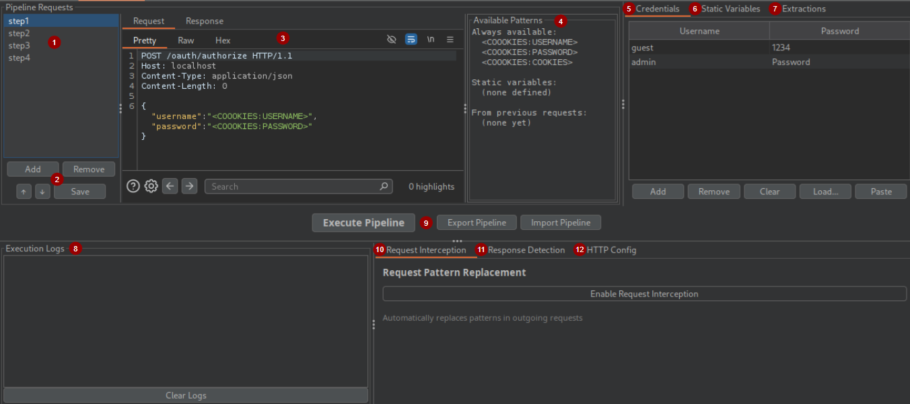

# COOOKIES – Burp Suite Extension


 

Burp Suite extension for automating multi-step authentication flows and managing session tokens across multiple user accounts.

---

## Overview

COOOKIES lets you build authentication pipelines — sequences of HTTP requests that log in one or more users and extract session tokens. Once a pipeline runs, extracted values can be injected into any Burp tool via patterns like `<__COOOKIES__:username>`.

It also monitors responses for session expiration strings and re-runs the pipeline automatically when a session dies.

---

## Installation

**Requirements:** Burp Suite Professional v2026.2.3 or later

1. Download `COOOKIES.jar` from Releases
2. In Burp: `Extensions` → `Installed` → `Add` → select the JAR

---

## GUI Overview



| # | Area |
|---|------|
| 1 | Pipeline request list |
| 2 | Add / remove / reorder requests |
| 3 | Raw HTTP request editor |
| 4 | Available patterns for the selected request |
| 5 | Credentials tab |
| 6 | Static variables tab |
| 7 | Extraction rules tab (runs on the selected request's response) |
| 8 | Execution logs |
| 9 | Execute / Import / Export buttons |
| 10 | Request interception toggle |
| 11 | Response interception toggle + expiration string config |
| 12 | HTTP config (port, HTTP/HTTPS) |

---

## Core Concepts

### Authentication Pipeline

A pipeline is a list of sequential HTTP requests. Each request can have **extraction rules** that pull values from the response (headers, JSON fields, or regex capture groups). Extracted values become available as patterns in all subsequent requests.

### Patterns

Use these placeholders inside pipeline requests or Burp tools:

| Pattern | Where usable | Description |
|---------|-------------|-------------|
| `<COOOKIES:USERNAME>` | Pipeline only | Current user's username |
| `<COOOKIES:PASSWORD>` | Pipeline only | Current user's password |
| `<COOOKIES:COOKIES>` | Pipeline only | Aggregated `Set-Cookie` values from previous step |
| `<COOOKIES:VAR_NAME>` | Pipeline only | Static variable or extracted value |
| `<COOOKIES:username:extractionName>` | Burp tools | Per-user extracted value |
| `<__COOOKIES__:username>` | Burp tools | Final auth value for a specific user |

### Extraction Types

- **Header** — pull a value from a response header (e.g. `Set-Cookie` → aggregates all cookies)
- **JSON** — path notation, e.g. `['data']['token']`
- **Regex** — stores the **first capture group**, e.g. `token=([^;]+)`

---

## Usage

### 1. Build a Pipeline

1. Open the **COOOKIES** tab
2. Click `Add` to add a request, give it a name
3. Edit the raw HTTP request in the editor
4. Go to the **Extractions** tab for that request and add extraction rules
5. Use the `Available Patterns` panel to see what values are injectable at each step

### 2. Add Credentials

- **Manual**: `Credentials` tab → `Add`
- **File**: one `username:password` per line → `Load...`
- **Paste**: copy `username:password` lines → `Paste`

### 3. Run the Pipeline

Click `Execute Pipeline`. Watch the **Execution Logs** to verify each step and check that extractions resolved correctly.

### 4. Use Patterns in Burp Tools

**Request interception must be enabled** (bottom-right panel) for patterns to be replaced in outgoing requests.

- Paste patterns into Repeater, Intruder, etc. — they're replaced automatically on send
- **Context menu**: right-click in a request editor → `Extension` → `COOOKIES` → choose a pattern to insert or copy
- **Hotkey** (`Ctrl+Shift+C` by default): cycles between users in Repeater. Rebindable in `Settings > Extensions > COOOKIES` (requires reload)
- **Third-party tools**: patterns work in any traffic proxied through Burp:

```bash
curl -is "https://auth.example.com/" \
  -H "Authorization: Bearer <__COOOKIES__:username>" \
  -x http://127.0.0.1:8080 -k
```

### 5. Session Auto-Refresh

1. Go to the **Response Detection** tab
2. Enable **Response Interception**
3. Add expiration strings (e.g. `"401 Unauthorized"`, `"Session expired"`)
4. When a response matches, the pipeline re-runs automatically
5. Flagged responses get a `Coookies-Expiration: HIT` header injected

### 6. Static Variables

`Static Variables` tab → add a name/value pair → use as `<COOOKIES:VAR_NAME>` in pipeline requests. Useful for things like OAuth code challenges.

### 7. Import / Export

Use the `Export Pipeline` / `Import Pipeline` buttons to save and load `.coookies` files. Includes requests, extractions, credentials, and settings.

You can also click `Save to Project` to persist the extension configuration directly into the Burp Suite project file. This way everything is restored automatically when you reopen the project — no need to re-import a `.coookies` file each time.

---

## Example Pipeline

**Credentials:** `guest:1234`, `admin:Password`

**Step 1 — Get CSRF Token**

```http
GET /api/token HTTP/1.1
Host: auth.example.com
```

Response:
```http
HTTP/1.1 200 OK
Set-Cookie: session_id=kngrupq35z4ddslr; HttpOnly
Set-Cookie: token=02a7e755d0aee6ed1e598acfa0c403f4; HttpOnly
Content-Type: text/html
Content-Length: 539
Connection: close

<!DOCTYPE html>
<html>
<head><title>Login</title></head>
<body>
  <h1>Login</h1>
  <form>
    <input name="username" placeholder="Username"><br>
    <input name="password" type="password" placeholder="Password"><br>
    <button>Login</button>
  </form>
</body>
</html>
```

Extractions on the response:
- **Header**: `Set-Cookie` → save as `cookies` → `session_id=...; token=...`
- **Regex**: `token=([^;]+)` → save as `x-csrf` → `02a7e755d0aee6ed1e598acfa0c403f4`

**Step 2 — Login**

```http
POST /api/login HTTP/1.1
Host: auth.example.com
Cookie: <COOOKIES:cookies>
X-Csrf-Token: <COOOKIES:x-csrf>
Content-Type: application/x-www-form-urlencoded

username=<COOOKIES:USERNAME>&password=<COOOKIES:PASSWORD>
```

Response:
```json
{"access_token":"082e3c29c35262e5f7d80a1bf6c1b129"}
```

Extraction:
- **JSON**: `['access_token']` → save as **Final Auth Value**

**Use in Repeater:**

```http
GET /api/user/profile HTTP/1.1
Host: auth.example.com
Authorization: Bearer <__COOOKIES__:guest>
```

```http
POST /api/user/editemail HTTP/1.1
Host: auth.example.com
Authorization: Bearer <__COOOKIES__:admin>
X-Csrf-Token: <COOOKIES:admin:x-csrf>
Content-Type: application/x-www-form-urlencoded

email=foo@bar.com
```

---

## Examples

1. Build a working authenticated request with the context menu; use the Logger to verify pattern resolution

https://github.com/user-attachments/assets/22ee75a6-7559-4d7d-8fd7-ed124a5909a9

2. Using the hotkey to quickly switch between users (`admin` and `guest`)

https://github.com/user-attachments/assets/cc454ffa-789f-4776-9f79-37eb0db36431

3. Session Auto-Refresh in action

https://github.com/user-attachments/assets/c0207460-a3d4-4c15-bb99-e1f480cb980c

---

## Works Great With LazyFlow

Setting up extraction rules manually can be tedious for complex flows. **LazyFlow** solves this — select your **Login flow** requests in the Proxy, send them to LazyFlow, and it automatically detects all the values flowing between requests and generates a `.coookies` file with placeholders and extraction rules already configured. Import that file into COOOKIES and you're ready to run immediately.

See the [LazyFlow](https://github.com/I-blank-I/LazyFlow) for details.

> **⚠ Note:** The Credentials component **WILL NOT** be filled automatically — you will still need to manually add your credentials set. LazyFlow handles the flow structure, but the credentials are yours to configure.

---

## Debugging

Check the **Burp Logger** to see if patterns are being resolved correctly, both during pipeline execution and in Burp tools.

---

## Disclaimer

For authorized security testing only. Always get proper permission before testing systems you don't own.

---

## Issues

Open an issue with your Burp Suite version, extension version, and steps to reproduce.
